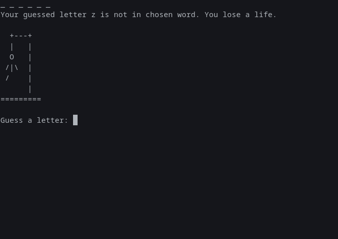

# Py-hangman
Hangman is a popular word guessing game where the player attempts to build a missing word by guessing one letter at a time. After a certain number of incorrect guesses, the game ends and the player loses. The game also ends if the player correctly identifies all the letters of the missing word.

